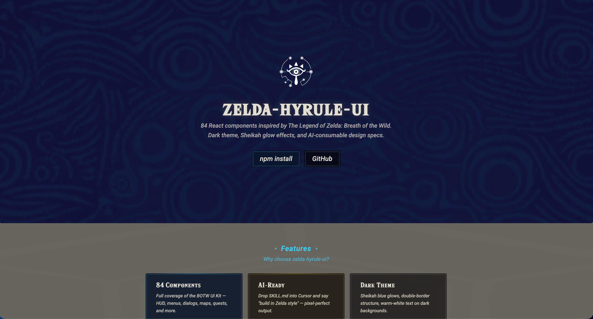
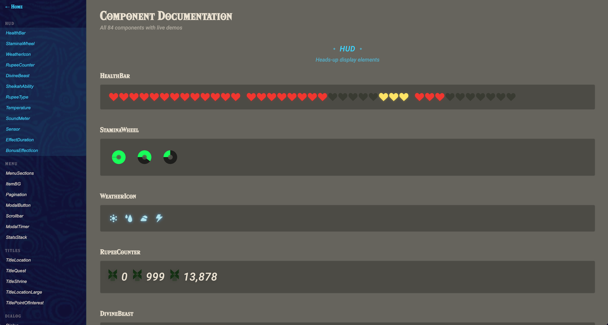

<div align="center">

# 🗡️ zelda-hyrule-ui

[](https://www.npmjs.com/package/zelda-hyrule-ui)
[](https://www.npmjs.com/package/zelda-hyrule-ui)
[](https://github.com/chaos-xxl/zelda-hyrule-ui/stargazers)
[](LICENSE)

[](https://chaos-xxl.github.io/zelda-hyrule-ui/#/docs)
[](https://react.dev)
[](https://typescriptlang.org)
[](https://vitejs.dev)
[](skill/SKILL.md)
[](#)
[](#)

</div>

A React UI component library inspired by *The Legend of Zelda: Breath of the Wild*.
83 components with dark theme, Sheikah glow effects, and AI-consumable design specs.

一套受《塞尔达传说：旷野之息》启发的 React UI 组件库。
83 个组件，暗色主题 + 希卡之石辉光效果，附带 AI 可消费的设计规范。





### 🔗 Preview

- **Online Preview (PC):** [zelda-hyrule-ui](https://chaos-xxl.github.io/zelda-hyrule-ui/)
- **Online Preview (Mobile):** [zelda-hyrule-ui-mobile](https://chaos-xxl.github.io/zelda-hyrule-ui/#/mobile)
- **Component Docs:** [All 83 components](https://chaos-xxl.github.io/zelda-hyrule-ui/#/docs) — live previews, code examples, and props tables

### 🔗 预览

- **在线预览（PC）：** [zelda-hyrule-ui](https://chaos-xxl.github.io/zelda-hyrule-ui/)
- **在线预览（Mobile）：** [zelda-hyrule-ui-mobile](https://chaos-xxl.github.io/zelda-hyrule-ui/#/mobile)
- **组件文档：** [全部 83 个组件](https://chaos-xxl.github.io/zelda-hyrule-ui/#/docs)——实时预览、代码示例和 Props 表格

---

## Installation / 安装

```bash
npm install zelda-hyrule-ui
```

---

## Quick Start / 快速开始

```tsx
import { HealthBar, StaminaWheel, Button, Card } from 'zelda-hyrule-ui'
import 'zelda-hyrule-ui/style'

export default function App() {
  return (
    <div style={{ background: '#66645D', padding: 40, minHeight: '100vh' }}>
      {/* HUD elements */}
      <HealthBar current={10} max={13} bonus={3} />
      <StaminaWheel value={0.75} size={70} />

      {/* Cards */}
      <Card variant="sheikah" title="Sheikah Slate">
        Distilling rune...
      </Card>

      {/* Buttons */}
      <Button variant="sheikah">Activate</Button>
      <Button variant="primary">Confirm</Button>
    </div>
  )
}
```

More examples / 更多示例:

```tsx
// Dialog
import { Dialog, DialogChoice } from 'zelda-hyrule-ui'

<Dialog type="speech" speaker="Old Man">
  It is cold here. You should find warm clothes.
</Dialog>

<DialogChoice
  options={[{ label: 'Yes', value: 'yes' }, { label: 'No', value: 'no' }]}
  selectedIndex={0}
/>
```

```tsx
// Quest tracking
import { QuestListItem } from 'zelda-hyrule-ui'

<QuestListItem
  title="Destroy Ganon"
  location="Hyrule Castle"
  questType="main"
  state="marked"
/>
```

```tsx
// Divine Beasts & Abilities
import { DivineBeast, SheikahAbility } from 'zelda-hyrule-ui'

<DivineBeast beast="ruta" charges={1} />
<SheikahAbility ability="magnesis" />
<SheikahAbility ability="stasis" plus />
```

```tsx
// Sheikah Slate themed layout
import { SheikahBackground, SheikahScanlines, SheikahTextTitle } from 'zelda-hyrule-ui'

<SheikahBackground color="darkBlue">
  <SheikahScanlines animated opacity={0.08} />
  <SheikahTextTitle title="Compendium" description="Creatures of Hyrule" />
</SheikahBackground>
```

---

## For AI Users / AI 用户指南

The simplest way to use this library with AI:

最简单的 AI 使用方式：

1. **Give your AI the GitHub link** and say "use this style to build me a landing page"

   把 GitHub 链接丢给 AI，说"用这个风格给我做一个落地页"

2. **Or** drop `skill/SKILL.md` into Cursor rules, then say "Build in Zelda style"

   或者把 `skill/SKILL.md` 放进 Cursor rules，然后说"用塞尔达风格做"

3. **Or** install the package and reference `AI_USAGE.md` for the full API

   或者安装包后参考 `AI_USAGE.md` 获取完整 API

### AI Documentation Files / AI 文档

| File | For | Purpose |
|------|-----|---------|
| [`skill/SKILL.md`](skill/SKILL.md) | Cursor / Copilot | Routing-layer skill (progressive disclosure) — design rules + load-on-demand `references/` for pixel-level specs |
| [`AI_USAGE.md`](AI_USAGE.md) | AI assistants | Complete API reference — all props, types, defaults |
| [`DESIGN_PROMPT.md`](DESIGN_PROMPT.md) | v0 / Figma AI / MJ | One-click design generation prompts |

| 文件 | 面向 | 用途 |
|------|-----|---------|
| [`skill/SKILL.md`](skill/SKILL.md) | Cursor / Copilot | 路由层 skill（渐进披露）——设计铁律 + 按需加载的 `references/` 像素级规范 |
| [`AI_USAGE.md`](AI_USAGE.md) | AI 编程助手 | 完整 API 手册——所有 props、类型、默认值 |
| [`DESIGN_PROMPT.md`](DESIGN_PROMPT.md) | v0 / Figma AI / MJ | 一键设计生成提示词 |

---

## Components (83) / 组件

| Category | Count | Components |
|----------|-------|------------|
| **HUD** | 16 | HealthBar, StaminaWheel, WeatherIcon, RupeeCounter, DivineBeast, SheikahAbility, RupeeType, Temperature, SoundMeter, Sensor, EffectDuration, BonusEffectIcon, LoadingIcon, HorseSpur, QuickSelector, LoadingHeart |
| **Menu** | 8 | MenuSections, ItemBG, Pagination, ModalButton, Scrollbar, ModalTimer, StatsStack, ModalTutorial |
| **Titles** | 5 | TitleLocation, TitleQuest, TitleShrine, TitleLocationLarge, TitlePointOfInterest |
| **Dialog** | 3 | Dialog, DialogChoice, DialogFloating |
| **Sheikah** | 8 | SheikahSymbol, SheikahBackground, SheikahScanlines, SheikahRune, SheikahCompendiumEntry, SheikahTextTitle, SheikahCompendiumFilters, SheikahAlbumButton |
| **Map** | 7 | MapIcon, MapBeacon, MapQuestMarker, MapLocationName, MapCursor, MapHeroLocation, MapGrid |
| **Quest** | 4 | QuestListItem, QuestDescription, QuestTypeIcon, QuestNotification |
| **Battle** | 4 | ItemEnchantment, StatusHealing, AimingReticle, AttackDefenseValues |
| **Controls** | 2 | ControllerButton, ActionSet |
| **Shop** | 3 | ShopListItem, ShopPriceQuantity, NumberInput |
| **Settings** | 1 | SettingsToggle |
| **Decorations** | 6 | TitleOrnament, DirectionalArrow, Starburst, TextOrnamentCorner, TimerOrnament, Illustration |
| **Brand** | 1 | Logo |
| **Common** | 6 | Button, Card, Modal, Divider, Loading, Toast |
| **Screens** | 9 | MenuScreen, QuestScreen, LoadingScreen, TitleScreen, GameOverScreen, SystemScreen, ShopScreen, SheikahMapScreen, QuickSelectorScreen |

> 📖 Full interactive docs with code examples and props tables: **[Online Documentation](https://chaos-xxl.github.io/zelda-hyrule-ui/#/docs)**
>
> 完整交互式文档（含代码示例和 Props 表格）：**[在线文档](https://chaos-xxl.github.io/zelda-hyrule-ui/#/docs)**

---

## Design Tokens / 设计变量

| Token | Value | Usage |
|-------|-------|-------|
| Sheikah Blue | `#3CD3FC` | Core accent, glows, focus states |
| Sheikah Yellow | `#FFE460` | Highlights, active states |
| Effect Orange | `#FCC413` | Confirm buttons, golden glow |
| Main Tan | `#E2DED3` | Borders, titles |
| Text Main | `#E9E1D1` | Body text (warm white) |
| Dark BG | `#66645D` | Page background |
| Deep Dark | `#1A1A2E` | Sheikah Slate panels |

| 变量 | 值 | 用途 |
|------|-----|------|
| 希卡蓝 | `#3CD3FC` | 核心主色、辉光、焦点态 |
| 希卡黄 | `#FFE460` | 高亮、激活态 |
| 效果橙 | `#FCC413` | 确认按钮、金色辉光 |
| 米色 | `#E2DED3` | 边框、标题 |
| 主文字 | `#E9E1D1` | 正文（暖白） |
| 深色背景 | `#66645D` | 页面背景 |
| 深暗色 | `#1A1A2E` | 希卡之石面板 |

---

## Tech Stack / 技术栈

| | |
|---|---|
| Framework | React 18 + TypeScript |
| Build | Vite (library mode, ESM + CJS dual output) |
| Styling | Less Modules (`zelda-[local]-[hash:5]` scoped names) |
| Assets | SVGs exported from Figma, externalized via `@laynezh/vite-plugin-lib-assets` |
| Fonts | Hylia Serif + Cinzel + Roboto |
| Bundle | ~115KB ESM, tree-shakeable |

---

## Local Development / 本地开发

```bash
git clone https://github.com/chaos-xxl/zelda-hyrule-ui.git
cd zelda-hyrule-ui
npm install
npm run dev       # Start demo dev server
npm run build     # Build component library
npm run deploy    # Deploy demo to gh-pages
```

---

## Contributing / 贡献

See [CONTRIBUTING.md](CONTRIBUTING.md) for guidelines.

贡献指南请参阅 [CONTRIBUTING.md](CONTRIBUTING.md)。

---

## Credits / 致谢

This project is built on top of the [**Zelda BOTW UI Kit**](https://www.figma.com/community/file/965825767811358609) by [**Hunter Paramore**](https://hunterparamore.com), shared on the Figma Community. All UI elements, icons, and visual structure originate from this kit. The Figma file is the foundation of every component in this library — all SVGs were exported node-by-node from the original work.

本项目基于 [**Hunter Paramore**](https://hunterparamore.com) 在 Figma 社区分享的 [**Zelda BOTW UI Kit**](https://www.figma.com/community/file/965825767811358609) 构建。所有 UI 元素、图标和视觉结构都源自该素材包。本组件库的全部 SVG 都是从原始 Figma 文件中逐节点精确导出的。

If you use this library or the original UI kit, please credit Hunter Paramore.

如果你使用本库或原始素材，请同时致谢 Hunter Paramore。

| Resource | Link |
|----------|------|
| Original Figma file | https://www.figma.com/community/file/965825767811358609 |
| Author profile | https://hunterparamore.com |
| Author's Figma | [Hunter Paramore on Figma](https://www.figma.com/@hparamore) |

---

## License / 许可证

MIT — For learning and personal use only. This is a fan-creation project. All Zelda-related trademarks belong to Nintendo.

MIT — 仅供学习和个人使用。本项目为粉丝创作，所有塞尔达相关商标归任天堂所有。
